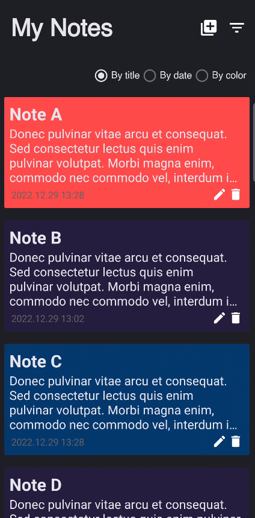
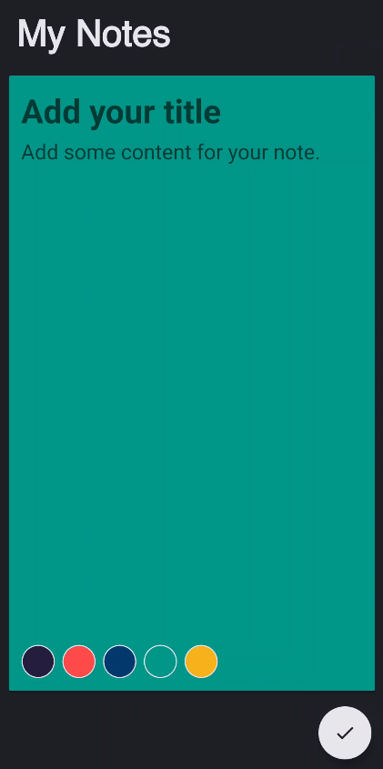

# MVVM Challenge - Notes App ✒ 

Android application for creating, editing, and deleting personal notes, using Kotlin with Model-View-ViewModel as architecture design.

    
    
    

# Contributing

1. Fork & clone this repository.
2. Start a new feature branch. 
3. Open `solutions` folder and access your Dev Sprint's project.
4. Build, run and code! 👩‍💻

# About Devpass

Devpass is a diverse community of high-potential software developers accelerating their careers through real-world product development and mentorship from tech leaders of the best tech companies.

Interested? Access www.devpass.com for more information!